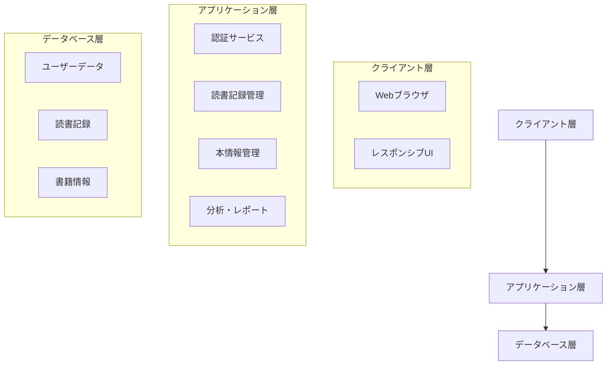
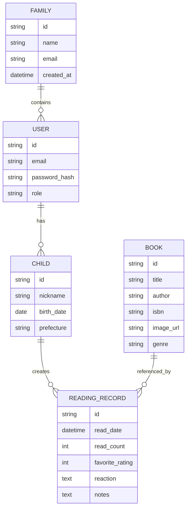

# 子供の読書記録管理アプリケーション 設計プラン

## 1. システムアーキテクチャ

## 2. データモデル設計

## 3. 主要機能詳細

### 3.1 認証・ユーザー管理
- メールアドレスによる認証システム
- 家族アカウント管理（最大10家族）
- 子供プロフィール管理（家族あたり最大10人）

### 3.2 読書記録機能
- ISBN検索による本の登録
- 読書日時の記録
- お気に入り度の登録（5段階評価）
- 子供の反応・感想の記録
- 画像付き本の情報管理

### 3.3 分析・可視化機能
- カレンダーベースの読書記録表示
- 読書統計（月別、ジャンル別）
- お気に入り本のリスト化
- 読書傾向の分析レポート

### 3.4 データ管理
- クラウドベースのデータ保存
- 定期的なバックアップ
- データのエクスポート機能

## 4. 技術スタック

### フロントエンド
- React.js（モダンなUI構築）
- Next.js（SSRとルーティング）
- Tailwind CSS（レスポンシブデザイン）
- Chart.js（データ可視化）

### バックエンド
- Node.js + Express
- PostgreSQL（リレーショナルデータベース）
- Firebase Authentication（認証）
- AWS S3（画像ストレージ）

### インフラ
- Vercel（フロントエンドホスティング）
- Heroku（バックエンドホスティング）
- AWS RDS（データベース）

## 5. 開発フェーズ

### フェーズ1: 基盤開発（4週間）
- プロジェクト設定
- 認証システムの実装
- 基本的なデータベース設計

### フェーズ2: コア機能開発（6週間）
- 読書記録機能の実装
- 本の登録・管理機能
- 基本的なUI実装

### フェーズ3: 分析機能開発（4週間）
- データ可視化機能
- 統計分析機能
- レポート生成機能

### フェーズ4: UI/UX改善（3週間）
- レスポンシブデザインの最適化
- ユーザビリティテスト
- パフォーマンス改善

### フェーズ5: テストと展開（3週間）
- 統合テスト
- セキュリティテスト
- 本番環境への展開

## 6. セキュリティ考慮事項
- SSL/TLS暗号化
- セキュアなパスワード管理
- データベースのバックアップ
- アクセス制御とロギング